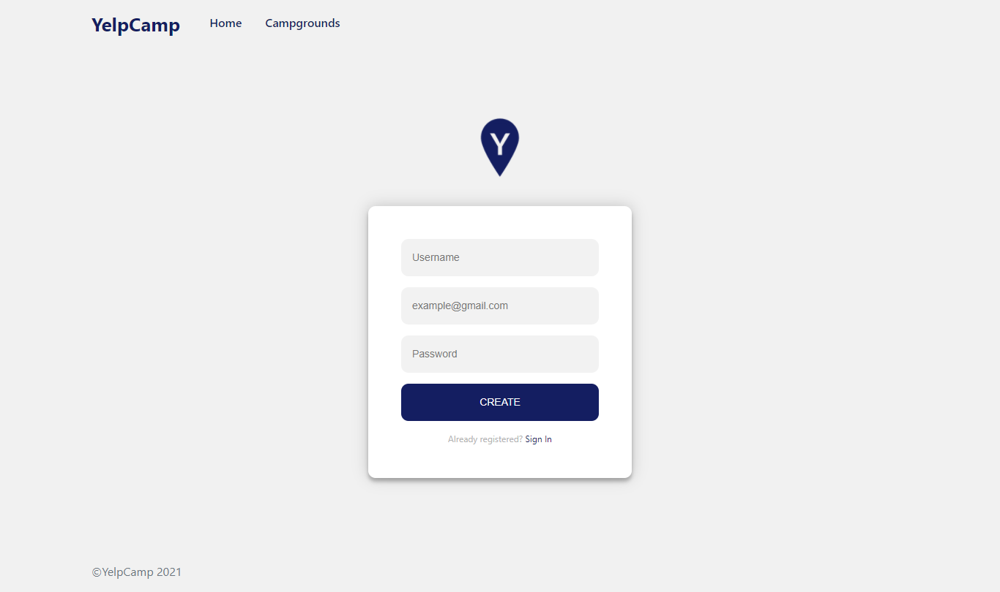

# yelp-camp

YelpCamp is a website where users can create and review campgrounds. In order to review or create a campground, you must have an account.
This project was created using Node. js, Express, MongoDB, and Bootstrap.

## Installation

Use the package manager [npm](https://www.npmjs.com/get-npm) to install all required dependecies.
```bash
npm install
```

## Usage :

After install all dependecies, start developing by typing this:
```bash
npm run start-dev
```

## Screenshoots

<div align="center">
  <h3>Landing Page</h3>
  

  <h3>Register</h3>
  

  <h3>Campgrounds</h3>
  

  <h3>Campground Detail</h3>
  
</div>
